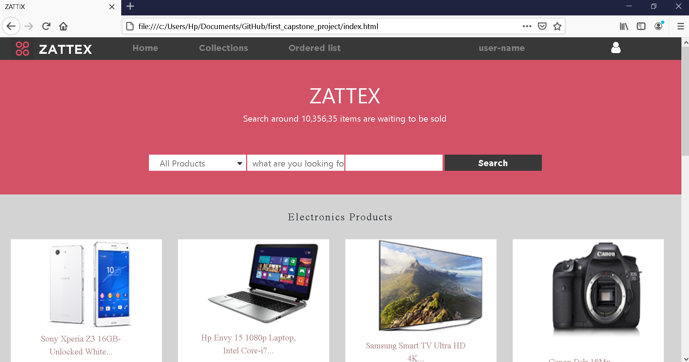
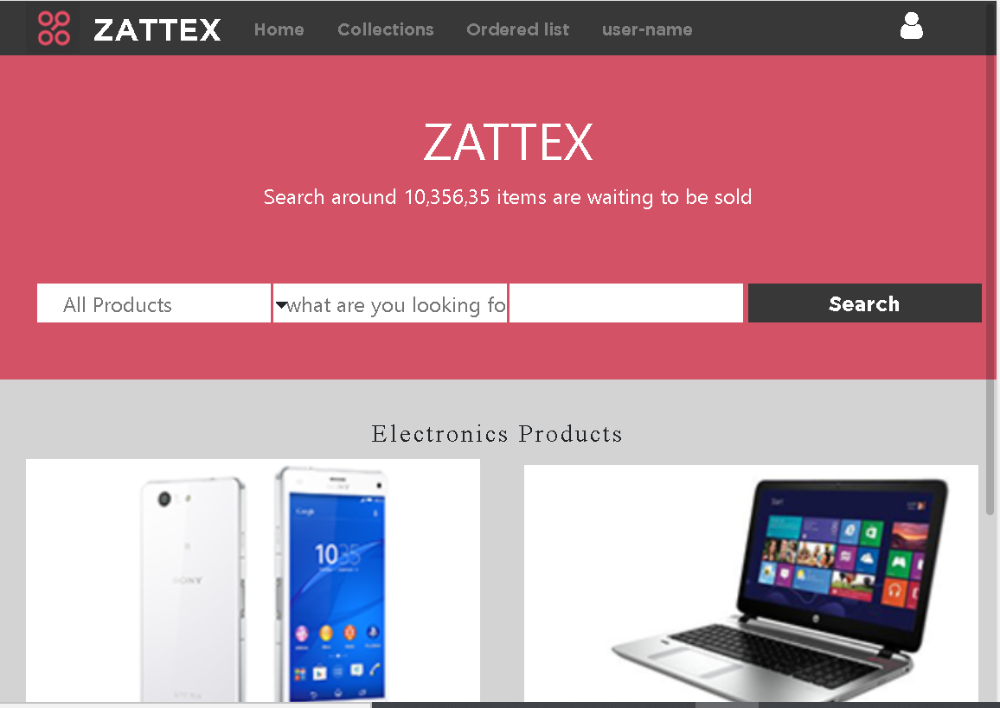
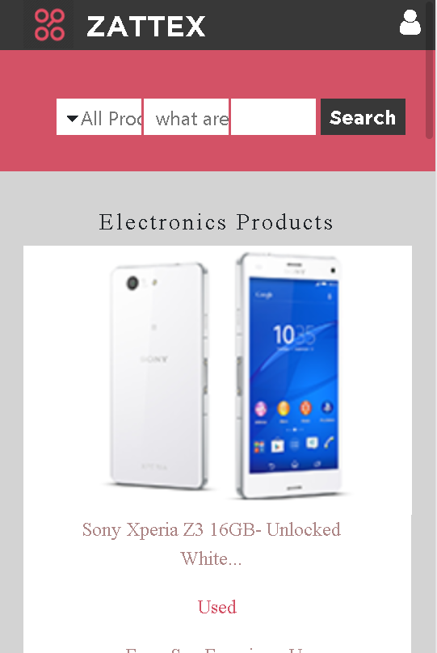

# The Electronic Store Capstone Project - A Microverse Project

### **Description:** 

Project based on The Electronic Store home page, it shows a navbar with User Icon on the top-right corner, a main section with  data related information and a footer section.
 
 **Header (Navbar section):**
 
 	- A Navbar with multiple options based on user's preference.
 	- A User Name option for Log-In.
    - A User Icon on the top right.

 **Main section:**
 
 	- Embedded electronic product images with descriptive information.
 	- Add Icon to add multiple products.
 	
 **Footer section:**
    - Multiple social networking logo's.
 	- URLs redirecting to Legal, Privacy, and Security sites with further information.
 	- Text related to legal information about the website.
    - Categories for different products.
    - A Navigation with multiple options alomg with Sign-In and Sign-Out.
    

## Built With

- 
- 

## Live Demo

[Live Demo Link]( https://imran5644.github.io/first_capstone_project/.)

##  Getting Started

To run the code simply download the repository by either cloning it or 
downloading it as Zip file. Then use the old trustable browser to open the HTML file.

## Authors

**Imran Yousaf**

- GitHub: [@imran5644](https://github.com/imran5644)
- LinkedIn: [Imran Yousaf](https://www.linkedin.com/in/imran-yousaf-8777297b/)

##  Contributing

Contributions, issues, and feature requests are welcome!

## Show your support

Give a ⭐️ if you like this project!

## License

This project is [MIT](./LICENSE) licensed.